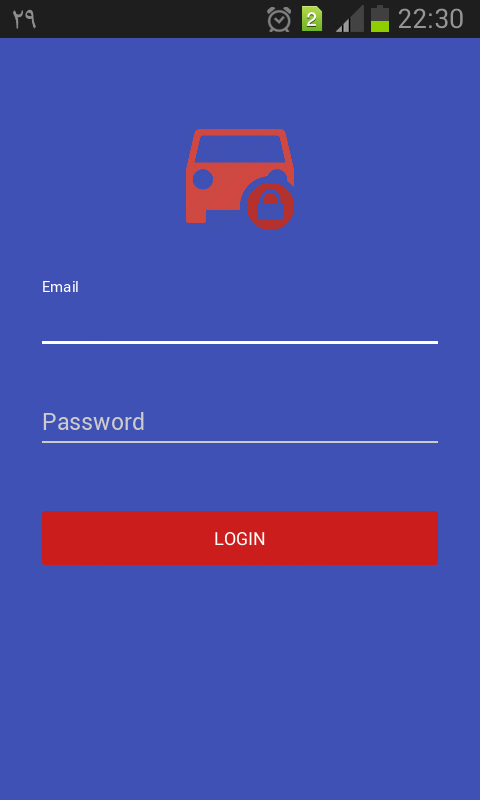

# AndroidESP8266NodeMCU
This porject created by  **[Sulkiflee](https://github.com/Sulkiflee)**  And I just added some changes for connecting exclusively the android phone and NodeMCU whitout additional wifi network added.

ESP8266 (NodeMCU) Control with Android Phone through the Internet

The Project review here >> <a href="https://youtu.be/wNFVlT7Mq6Y" target="_blank">ESP8266 (NodeMCU) Control with Android Phone through the Internet</a>

This Project has used direct connection from your Android Phone to ESP8266 NodeMCU that runs as web server to control your car <b>per to per whit out neet to another wifi connection  </b>. 

To passed the login screen, enter the following two values

login/Email = admin@gmail.com

password = abc123456

**application pictures...** 

